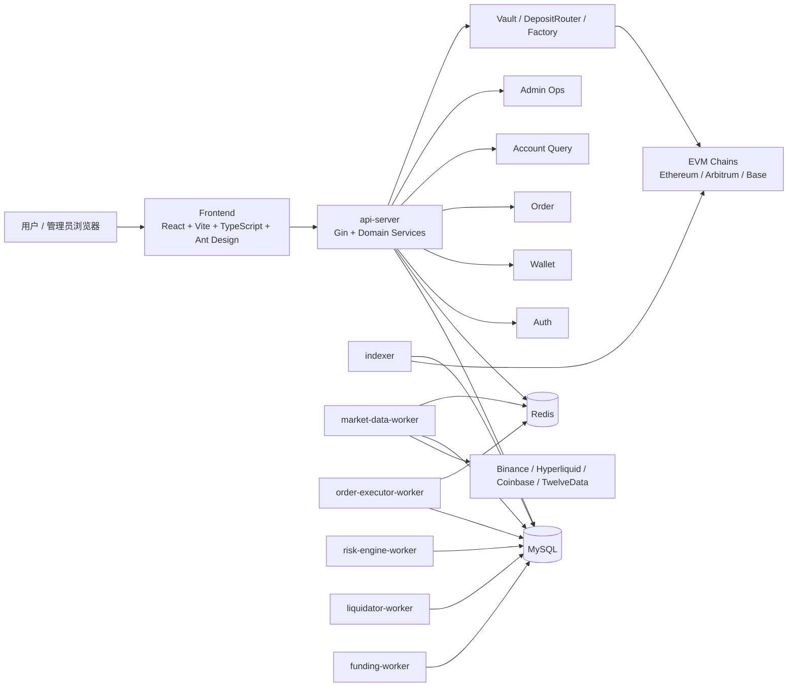
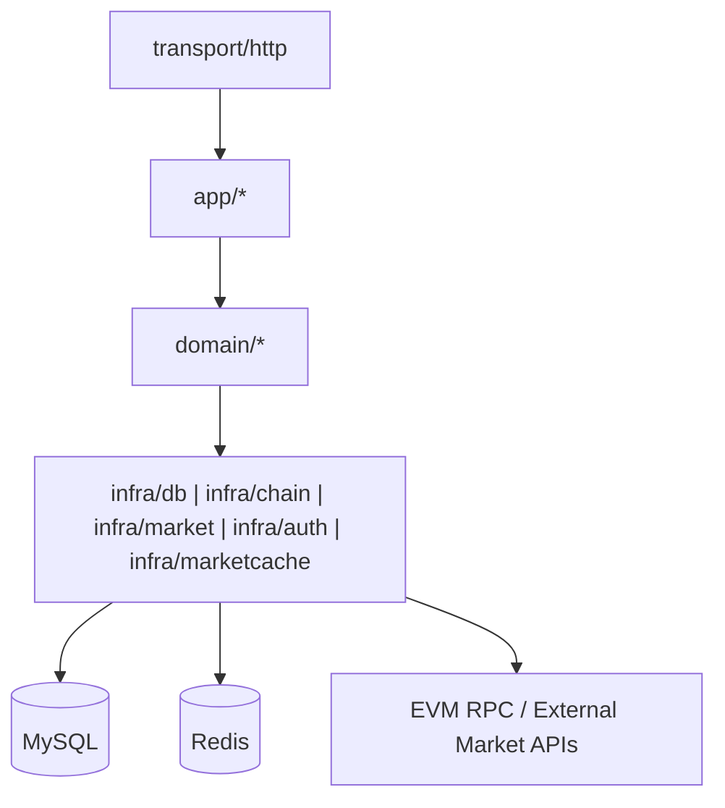
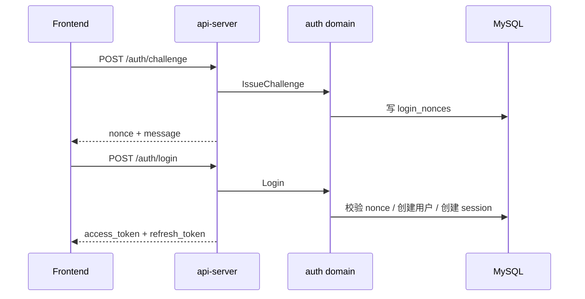
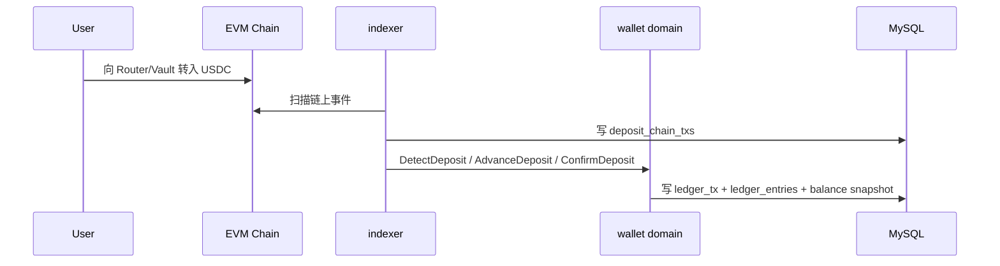
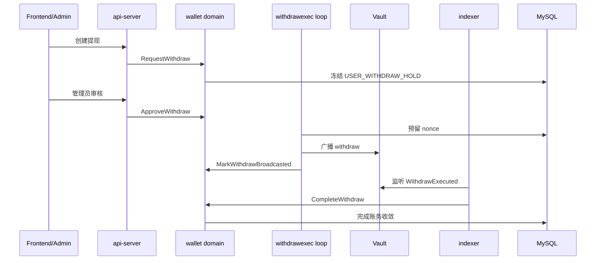
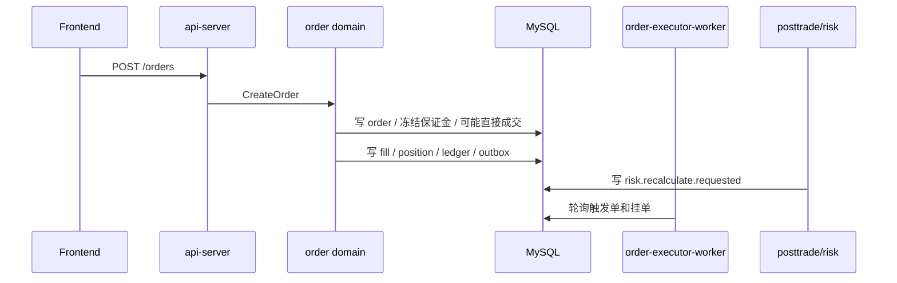
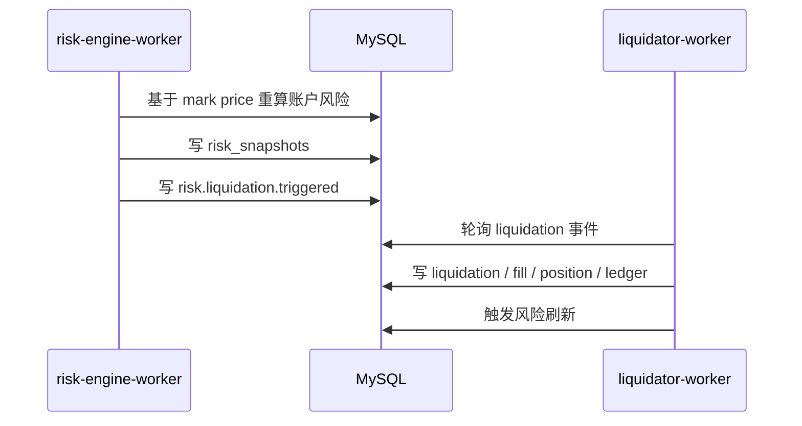
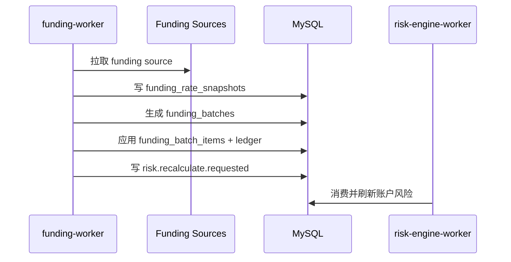

# 技术架构文档

## 1. 概述

RGPerp 是一个采用链上托管、链下交易、链下风控与链下清算的永续合约系统。系统以统一账本维护资金真相，以 MySQL 维护订单、仓位、风险与异步状态，以多进程 worker 承载行情、执行、风控、清算、资金费率和对冲等后台能力。

系统已经接通以下主业务链路：

- EVM challenge/login 认证；
- 多链充值、提现、内部转账；
- 统一账本、余额快照与 Explorer 事件查询；
- 永续订单、成交、仓位、风险重算与强平；
- 资金费率采集、批次生成、应用与反向冲正；
- Hyperliquid Testnet 真实对冲执行与外部仓位快照；
- Admin 运行时配置、审计、风险与资金运维。

系统边界同样明确：

- `outbox-relay` 与 `notification-worker` 不属于当前运行拓扑；
- 系统当前运行拓扑不依赖独立消息队列，核心业务异步链路以数据库 outbox 轮询消费为主；
- WebSocket 网关不在当前系统范围内，前端以 HTTP 轮询和写后刷新为主；
- 外部对冲账户作为平台独立风险域管理，不并入核心统一账本。

## 2. 系统架构

系统采用以下架构取舍：

- 托管与提现真相在链上；
- 账本、订单、仓位与风险真相在 MySQL；
- 异步编排优先通过数据库 outbox 和轮询 worker 完成；
- 运行时采用“模块化单体 + 多进程 worker”而不是微服务。

这些取舍直接带来以下结果：

- 资金主链路更容易维持事务一致性；
- 开发、联调、本地 review 和 docker compose 启动成本更低；
- 系统呈现明显的 DB-centric 特征，消息总线和更细粒度服务拆分属于后续架构演进主题，而不是当前运行前提。

### 2.1 顶层架构

### 2.2 运行拓扑

#### 2.2.1 实际进程

| 进程 | 作用 | 状态 |
| --- | --- | --- |
| `api-server` | HTTP 入口、认证、账户、钱包、订单提交、管理接口 | 已接入 |
| `indexer` | 扫描链上事件，推进充值/提现状态 | 已接入 |
| `market-data-worker` | 抓取市场数据并写入行情快照与 Redis 热缓存 | 已接入 |
| `order-executor-worker` | 执行挂单/触发单，完成成交、仓位和账本更新 | 已接入 |
| `risk-engine-worker` | 风险重算，消费风险重算请求，产生强平触发 | 已接入 |
| `liquidator-worker` | 消费强平触发并执行清算 | 已接入 |
| `funding-worker` | 资金费率采集、批次生成、应用与回推风险重算 | 已接入 |
| `migrator` | 数据库迁移辅助进程 | 已接入 |
| `hedger-worker` | 消费对冲意图、执行真实或模拟对冲、刷新系统级对冲快照 | 已接入 |
| `outbox-relay` | outbox 转发器 | 预留二进制，未进入当前运行拓扑 |
| `notification-worker` | 通知异步消费 | 预留二进制，未进入当前运行拓扑 |

#### 2.2.2 运行时特征

- `api-server` 内置提现广播执行循环；
- 多个 worker 不通过 MQ 直接订阅消息，而是轮询数据库中的 `outbox_events`；
- 配置中心采用运行时快照 + 轮询刷新模式，多个进程每 2 秒刷新一次运行时配置；
- 市场数据热值进入 Redis，但 Redis 不承担任何财务真相角色。

## 3. 模块划分

### 3.1 分层结构

### 3.2 分层职责

- `transport/http`
  负责 Gin handler、中间件、鉴权、HTTP DTO 与统一响应格式。
- `app`
  负责跨领域编排，主要包括 `adminops`、`posttrade`、`runtimeconfig`。
- `domain`
  承载核心业务规则，包含 `auth`、`wallet`、`ledger`、`order`、`risk`、`liquidation`、`funding`、`indexer`、`withdrawexec`、`market`、`hedge` 等领域。
- `infra`
  实现数据库仓储、链上适配器、市场数据客户端、JWT 与 Redis 缓存。

### 3.3 关键应用层组件

- `posttrade.Processor`
  在订单成交后发出 `risk.recalculate.requested` outbox 事件。
- `runtimeconfig.Service`
  维护动态运行时配置的查询与更新。
- `adminops.Service`
  承载保险基金补充、强平重试、强平关闭等管理动作。

### 3.4 组件与职责边界

#### 3.4.1 Frontend

前端已覆盖以下页面与功能入口：

- `landing`
- `login`
- `trade`
- `portfolio`
- `wallet/deposit`
- `wallet/withdraw`
- `wallet/transfer`
- `history`
- `explorer`
- `admin`

前端运行特征如下：

- 以 HTTP 读写为主；
- 没有独立 WS 推送通道；
- 管理页已经接入运行时配置、账本审计、强平和提现运维接口；
- 用户视图已覆盖交易、资产、资金流水、Explorer 事件。

#### 3.4.2 API Server

`api-server` 是系统的同步编排中心，对外暴露的 API 包括：

- `/api/v1/auth/*`
- `/api/v1/system/chains`
- `/api/v1/markets/*`
- `/api/v1/account/*`
- `/api/v1/wallet/*`
- `/api/v1/orders`、`/fills`、`/positions`
- `/api/v1/explorer/events`
- `/api/v1/admin/*`

除 HTTP 入口职责外，`api-server` 同时承担以下系统职责：

- Bootstrap 系统账户和市场基础数据；
- 加载并轮询运行时配置；
- 在本地 review/dev 模式下启动链上提现执行循环；
- 组合多个 query repository，形成面向前端的读模型。

#### 3.4.3 Auth

认证链路已经完整落地，包含：

- challenge/nonce 发放；
- EVM 签名验证；
- 用户自动创建；
- access/refresh token 签发；
- JWT 验证；
- 基于配置钱包地址的 admin 身份识别。

#### 3.4.4 Wallet

钱包域是系统中最完整的资金域之一，覆盖以下能力：

- 充值检测、推进、确认、重组回退；
- 充值地址生成；
- 提现申请、审核、退回复核、失败、广播、完成、退款；
- 用户内部转账；
- 本地 native faucet 支持；
- 提现风险评估器接入。

#### 3.4.5 Indexer

Indexer 通过 EVM RPC 轮询扫描链上事件，负责：

- 读取链上 `DepositForwarded`、`WithdrawExecuted` 等事件；
- 维护 `chain_cursors`；
- 多链确认数推进；
- 将链上事实写入 `deposit_chain_txs`；
- 通过调用 wallet domain 完成充值确认和提现完成回补；
- 对未知或异常链上情况发出 `wallet.indexer.anomaly` outbox 事件。

#### 3.4.6 Market Data

市场数据进程接入以下数据源：

- Binance；
- Hyperliquid；
- Coinbase；
- TwelveData。

其职责包括：

- 拉取 ticker/quote 元数据；
- 聚合指数价和标记价；
- 写入 `market_price_snapshots`、`mark_price_snapshots`；
- 刷新 Redis 最新行情缓存；
- 为交易、风险、资金费率提供统一价格输入。

#### 3.4.7 Order / Execution

订单域支持以下订单类型：

- `MARKET`
- `LIMIT`
- `STOP_MARKET`
- `TAKE_PROFIT_MARKET`

同时支持以下交易语义与执行能力：

- `OPEN` / `REDUCE` / `CLOSE`
- `CROSS` / `ISOLATED`
- `LONG` / `SHORT`
- 挂单轮询执行；
- 触发单轮询执行；
- 成交后账本与仓位原子更新；
- 撤单。

#### 3.4.8 Risk

风险域具备以下核心能力：

- 账户级风险快照；
- 权益、可用余额、维持保证金、风险率计算；
- 风险等级 `SAFE / NO_NEW_RISK / LIQUIDATING`；
- 标记价驱动的轮询重算；
- 成交/资金费率驱动的风险重算请求消费；
- 强平触发写入 outbox。

对冲相关能力如下：

- `risk` 域已能计算 `hedge intent` 并写入 `hedge.requested` 事件；
- `hedger-worker` 消费对冲相关 Outbox，并接通 Hyperliquid Testnet 的真实下单与仓位查询；
- `system_hedge_snapshots` 同时记录内部净敞口、目标对冲、系统已管理仓位与外部真实仓位；
- 新对冲单目标只基于内部净敞口与系统已管理仓位计算；外部真实仓位只用于观测与漂移展示，不反向参与目标计算。

#### 3.4.9 Liquidation

强平域由独立 worker 驱动，具备以下能力：

- 消费 `risk.liquidation.triggered`；
- 执行清算；
- 写入 `liquidations` 与 `liquidation_items`；
- 生成强平成交、仓位变化和账本变更；
- 在清算结束后再次触发风险刷新；
- 支持 admin 侧重试和手工关闭。

#### 3.4.10 Funding

Funding 已形成完整运行链路，覆盖：

- 多源资金费率采集；
- 资金费率归一化与聚合；
- 生成 `funding_batches`；
- 应用 `funding_batch_items`；
- 对受影响用户发出 `risk.recalculate.requested`；
- 支持 admin 逆向冲正 funding batch。

#### 3.4.11 Explorer 与 Admin

Explorer 未引入独立事件投影进程，直接聚合查询以下数据源：

- `outbox_events`
- `ledger_tx`
- `orders`
- `fills`
- `positions`
- `deposit_chain_txs`
- `withdraw_requests`

Admin 提供以下运维能力：

- 提现审核、退回复核、退款；
- 风险监控面板；
- 账户风险重算；
- 强平重试与关闭；
- 资金费率批次查看与反转；
- 运行时配置查看与更新；
- 账本概览、一键审计、审计导出；
- 保险基金补充。

### 3.5 数据拥有权与真相源

#### 3.5.1 真相源划分

| 数据类别 | 真相源 | 说明 |
| --- | --- | --- |
| 托管资产与提现执行 | EVM 链事件与 Vault 状态 | 最终以链上为准 |
| 用户资金变化 | `ledger_tx` + `ledger_entries` | 账本是资金真相 |
| 余额读优化 | `account_balance_snapshots` | 可重建，不是独立真相 |
| 订单 | `orders` | 订单生命周期真相 |
| 成交 | `fills` | 成交真相 |
| 仓位 | `positions` | 用户持仓真相 |
| 风险快照 | `risk_snapshots` | 风控执行结果快照 |
| 资金费率批次 | `funding_batches` / `funding_batch_items` | 批处理真相 |
| 链上索引游标 | `chain_cursors` | 多链扫描恢复点 |
| 异步事件 | `outbox_events` | 异步编排中枢 |
| 消费幂等 | `message_consumptions` | worker 去重记录 |

#### 3.5.2 关键原则

- 所有资金类变化必须经账本落地；
- 余额快照只是读优化；
- 业务成功不得早于账本提交；
- worker 的异步处理必须显式幂等；
- Redis 不保存不可恢复的财务事实。

### 3.6 异步模型

系统核心异步编排建立在数据库 outbox 与轮询 worker 之上，不依赖独立消息队列。

#### 3.6.1 异步链路模式

1. 业务事务在 MySQL 中提交源表与 `outbox_events`。
2. 后台 worker 周期性轮询特定 `event_type`。
3. worker 通过 `message_consumptions` 做消费去重。
4. 成功后保留消费记录，失败则删除消费记录并等待下次重试。

#### 3.6.2 适用链路

- post-trade -> `risk.recalculate.requested`
- risk -> `risk.liquidation.triggered`
- funding -> `risk.recalculate.requested`
- indexer / wallet / liquidation / funding 各类审计与 Explorer 事件

#### 3.6.3 模型特征

主要收益：

- 无需独立消息基础设施即可完成关键编排；
- 与财务事务天然同库，易于审计和排错；
- 适合单库多进程架构。

主要约束：

- 异步延迟由轮询周期决定；
- DB 压力高于真正的消息队列；
- 需要严格控制 outbox 清理与幂等逻辑。

## 4. 数据流

### 4.1 登录链路

### 4.2 充值链路

### 4.3 提现链路

### 4.4 订单与成交链路

### 4.5 风险与清算链路

### 4.6 资金费率链路

### 4.7 状态机

#### 4.7.1 充值

`DETECTED -> CONFIRMING -> CREDIT_READY -> CREDITED -> SWEPT`

异常分支：

- `DETECTED -> REORG_REVERSED`
- `ANY -> FAILED`

#### 4.7.2 提现

`REQUESTED -> HOLD -> RISK_REVIEW -> APPROVED -> SIGNING -> BROADCASTED -> CONFIRMING -> COMPLETED`

异常分支：

- `HOLD -> CANCELED`
- `RISK_REVIEW -> REJECTED`
- `BROADCASTED/CONFIRMING -> FAILED -> REFUNDED`

该状态机中有一个关键约束：

- `SIGNING` 表示 nonce 已经预留，发送结果若不确定，不能退回 `APPROVED` 重分配 nonce。

#### 4.7.3 订单

订单生命周期的主状态包括：

- `TRIGGER_WAIT`
- `RESTING`
- `FILLED`
- `CANCELED`
- `REJECTED`

#### 4.7.4 仓位

仓位生命周期的主状态包括：

- `OPEN`
- `CLOSED`
- `LIQUIDATING`

#### 4.7.5 风险等级

- `SAFE`
- `NO_NEW_RISK`
- `LIQUIDATING`

#### 4.7.6 Funding Batch

Funding 批次覆盖以下状态：

- 创建；
- 应用；
- 反转。

## 5. 关键设计权衡

### 5.1 模块化单体 + 多进程，而不是微服务

采用的实现方式如下：

- 单一 Go 代码库；
- 共享领域包；
- 单一 MySQL schema；
- 多 worker 按负载拆开。

主要收益：

- 资金与交易主链路更容易做强一致事务；
- 本地和 review 环境更容易启动；
- 代码边界清晰，但不必承受微服务治理成本。

相应约束：

- 同库耦合较强；
- 异步链路更多依赖轮询而不是事件总线；
- 后续拆分服务时需要重新梳理跨边界契约。

### 5.2 MySQL outbox 轮询，而不是先引入独立消息总线

采用的实现方式如下：

- 关键异步路径直接基于 `outbox_events`；
- worker 轮询特定事件类型并消费。

收益：

- 事务内写出更简单；
- 排错时可以直接从数据库回溯；
- 适合当前系统规模与一致性要求。

代价：

- 吞吐和时延上不如真正消息队列；
- outbox 表会成为核心热点之一；
- 需要额外关注轮询频率、归档和清理。

### 5.3 API 内置提现执行循环，而不是独立广播服务

采用的实现方式如下：

- `api-server` 在存在本地 minter 私钥时，直接启动提现执行循环。

收益：

- 开发和 review 环境路径更短；
- 少一个独立部署进程。

代价：

- API 进程承担了部分后台任务职责；
- 提现广播能力与 HTTP 入口共处一进程，部署上更紧凑，但职责边界更集中。

### 5.4 对冲：执行链路已接通，账务边界独立管理

实现状态如下：

- `risk` 与 `hedge` 领域、数据库表和 Outbox 事件已具备；
- `hedger-worker` 已纳入标准编排并消费对冲类事件；
- 系统支持 Hyperliquid Testnet 的真实对冲执行与外部仓位查询；
- Admin 可查看对冲执行队列与系统级对冲风险快照。

账务边界如下：

- 外部对冲账户被视为平台独立风险账户；
- `hedge_*` 与 `system_hedge_snapshots` 负责记录对冲意图、执行状态、仓位镜像与外部漂移；
- 外部 Venue 的保证金、未实现盈亏、已实现盈亏、手续费尚未正式镜像进核心统一账本；
- 平台完整资金视图需要结合核心账本与外部对冲视图一起理解。

### 5.5 非功能架构

#### 5.5.1 一致性

- 账本、余额快照、订单、成交、仓位等关键变化在数据库事务内提交；
- 修正通过反向分录和补充分录完成；
- 资金主链路不依赖缓存。

#### 5.5.2 幂等与恢复

- 钱包、订单、资金费率、强平链路均显式使用幂等键；
- worker 消费使用 `message_consumptions` 去重；
- Indexer 通过 `chain_cursors` 支持恢复；
- 提现通过预留 nonce + 回补机制降低 orphan broadcast 风险。

#### 5.5.3 安全

- EVM challenge/login 使用 nonce、链 ID、过期时间；
- JWT 作为访问凭证；
- Admin 身份由配置白名单地址识别；
- 链上提现执行与链下审批分离；
- 异常链上事件不会直接进入余额。

#### 5.5.4 可观测性

可观测性主要依赖以下手段：

- 结构化日志；
- 数据库中可审计记录；
- Admin 查询和导出接口；
- Explorer 对 outbox 事件和业务对象的聚合视图。

#### 5.5.5 运维可调性

运行时配置支持动态更新以下参数：

- 全局 trace 要求；
- 市场参数；
- 风险参数；
- funding 参数；
- hedge 开关和阈值；
- pair 级配置。

多个进程会持续拉取最新运行时配置快照并生效。

### 5.6 架构特征

- 资金主链路已经是生产思路，而不是 Demo 级别的余额字段加减。
- 多链充值/提现、确认数、重组、提现 nonce 预留和回补都已经进入真实实现。
- 交易、风控、强平、资金费率已经形成闭环，不依赖手工脚本串联。
- Admin 运维面已经不是只读，已经具备强平、funding reversal、保险基金补充、账本审计等生产操作入口。
- 动态运行时配置已经真正接入多个进程，而不是静态配置文件重启生效。
- 架构以模块化单体为主，领域边界、表归属和 worker 职责清晰。

### 5.7 演进方向

系统已经能够稳定支撑资金与交易主链路的运行、联调与验证。接下来的实施重点包括：

- 深化 hedger 与外部 Venue 的自动化闭环与可观测性（`hedge.requested -> hedge.updated` 全链路验收）；
- 在口径明确后补齐外部对冲账户的账务镜像与对账任务；
- 视异步规模与延迟要求升级消息总线与死信治理；
- 将提现执行从 `api-server` 中剥离成独立 worker；
- 为 Explorer 引入更明确的投影层；
- 视交易实时性要求补充 WebSocket/SSE 推送；
- 持续把 DB-centric 实现演进为边界更清晰、恢复路径更标准化的异步系统。

### 5.8 总结

系统架构可概括为：

- 链上托管；
- 链下账本、交易、风险和清算；
- MySQL 作为交易与资金真相中心；
- Redis 作为行情热缓存；
- 多个后台 worker 基于数据库 outbox 轮询协作；
- 前端和管理后台通过统一 HTTP API 访问系统。

该系统不是目标态蓝图，而是已经跑通登录、充值提现、交易、风控、强平、资金费率、真实对冲执行和管理审计等主链路的模块化单体交易系统。
