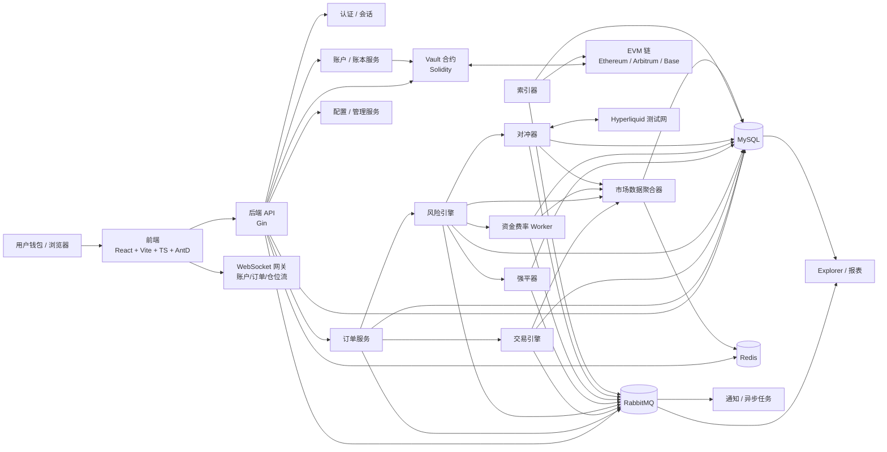
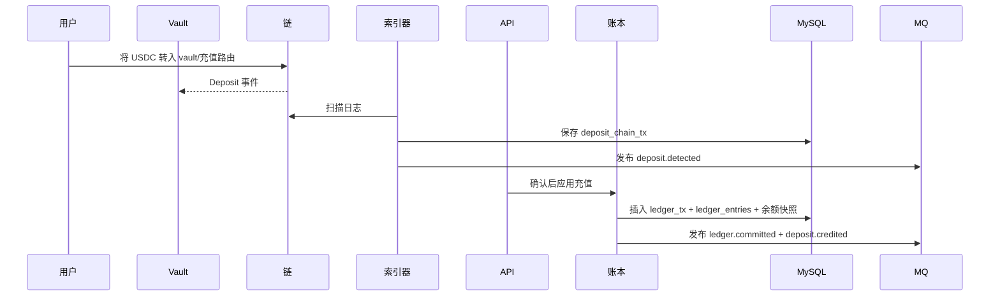
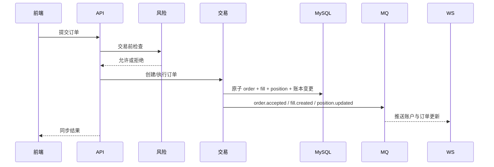
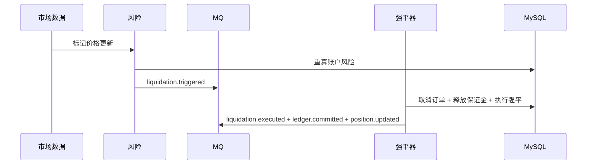
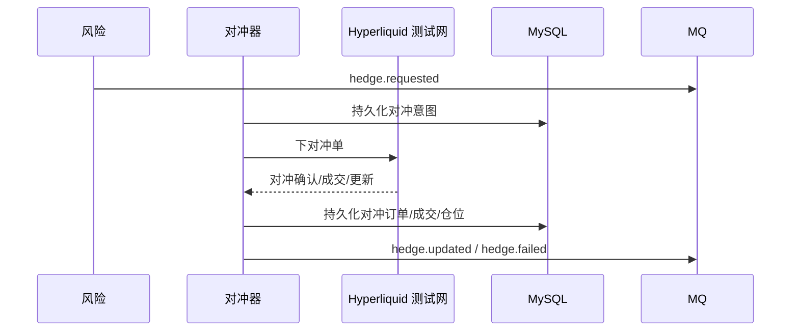

# 架构文档

## 1. 文档目的

本文档定义面向生产的永续合约交易所架构，具备以下特点：

- 链上托管；
- 链下交易；
- 链下风控；
- 链下强平；
- 通过 Hyperliquid 测试网进行外部对冲。

架构在以下实现约束下设计：

- 前端：React + Vite + TypeScript + Ant Design
- 后端：Go + Gin + GORM
- 数据：MySQL + Redis + RabbitMQ
- 合约：Solidity + Foundry
- 外部对冲场所：Hyperliquid 测试网

设计目标是将托管与最终资产归属保持于链上可验证，同时将撮合、定价、风险、强平、资金费率和对冲置于链下，以实现性能、可配置性和运维控制。

## 2. 核心设计原则

1. 托管真相在链上；交易真相在链下。
2. 账本是平台内部余额的真相源。
3. 订单、仓位、账本变更及风险变更必须保持事务一致性。
4. 市场数据、对冲、Explorer 索引、通知及分析为最终一致。
5. 在陈旧价格、保证金不足、钱包异常及对冲不确定时采用 Fail Closed（故障时拒绝）。
6. 所有关键变更必须幂等、可审计且可重放。

## 3. 系统范围

### 3.1 在范围内

- EVM 钱包登录
- 链上 USDC 充值与提现
- 链下账本与余额缓存
- CFD 永续合约订单执行
- 标记价格、风险、强平、资金费率
- Hyperliquid 测试网外部对冲
- Explorer、管理、配置及审计

### 3.2 P0 不在范围内

- 逐仓保证金
- 多抵押品保证金
- 期权与现货
- 完整 ADL 自动化
- 复杂资金库与冷钱包治理

## 4. 顶层架构



## 5. 主要组件与职责边界

### 5.1 前端

前端负责状态展示和交互，不作为余额、风险或权限的最终权威。

#### 职责

- 钱包连接及签名登录
- 账户概览：权益、可用余额、保证金、PnL
- 充值与提现界面
- 下单及撤单操作
- 仓位、订单、成交、资金费率及强平视图
- Explorer 及管理控制台视图
- 账户与市场更新的 WebSocket 订阅

#### 非职责

- 不维护客户端余额真相
- 不做客户端风控决策
- 不作为权限的最终权威

### 5.2 后端 API

后端 API 是面向用户和管理员的同步请求入口及编排边界。

#### 职责

- 钱包 nonce 发放及签名校验
- 会话发放及 RBAC 执行
- 输入校验与所有权检查
- 同步下单及撤单接口
- 充值地址查询、提现请求、划转请求
- 账户、订单、仓位及 Explorer 查询 API
- 管理配置及运维命令

#### 非职责

- 不直接扫描链上日志
- 不直接运行持续性风险循环
- 不直接执行外部对冲逻辑

### 5.3 Vault

Vault 是链上托管边界。

#### 职责

- 在合约控制的托管中持有用户充值 USDC
- 发出供链下索引的充值与提现事件
- 提供角色门控的提现执行路径
- 维护暂停及应急控制
- 提供可对账的确定性事件历史

#### 非职责

- 无链上订单簿
- 无链上仓位
- 无链上强平逻辑
- 无链上资金费率结算

### 5.4 Indexer（索引器）

Indexer 是链上真相与链下账本摄取的桥梁。

#### 职责

- 从 Vault 及支持的代币扫描链上事件
- 跟踪确认数及重组安全最终性
- 将链上事件转换为内部充值与提现事件
- 将充值/提现链记录写入 MySQL
- 将异步事件发布到 RabbitMQ
- 维护每链游标及重放能力

#### 非职责

- 不做面向用户的业务决策
- 不经账本服务不直接变更余额

### 5.5 Trade Engine（交易引擎）

Trade Engine 是 CFD 订单的链下执行核心。

#### 职责

- 使用实时市场数据校验可交易市场状态
- 使用聚合外部报价及内部价差规则计算成交价
- 立即处理市价单
- 触发满足条件的限价单及止损类订单
- 生成成交及执行元数据
- 更新订单状态并调用原子仓位与账本变更

#### 非职责

- 不独立托管
- 不做长期的账户级监控
- 不做最终对冲策略决策

### 5.6 Risk Engine（风险引擎）

Risk Engine 是链下交易前及运行时风险权威。

#### 职责

- 交易前检查：可用余额、杠杆、交易对状态、风险分级、价格新鲜度
- 实时账户权益及维持保证金重算
- 交易对与账户风险监控
- 保证金模式执行
- 强平触发产生
- 对冲阈值产生
- 资金费率结算准备

#### 非职责

- 不处理用户会话
- 不直接签署链上交易

### 5.7 Liquidator（强平器）

Liquidator 是 dedicated 高优先级 Worker，执行强平流程。

#### 职责

- 消费强平触发事件
- 优先取消挂单中增加风险的订单
- 释放订单保证金
- 执行部分或全额强平路径
- 落库强平成交、惩罚金及保险基金变更
- 持久化强平快照并发布审计事件

#### 非职责

- 不处理一般交易流量
- 不拥有市场数据聚合

### 5.8 Hedger（对冲器）

Hedger 通过 Hyperliquid 测试网管理平台净敞口。

#### 职责

- 按交易对和方向维护平台净敞口
- 与软/硬阈值比较敞口
- 在 Hyperliquid 测试网上下单、改单或平掉对冲仓位
- 持久化对冲订单、成交、仓位及划转记录
- 发布对冲结果及异常事件

#### 非职责

- 不直接管理用户仓位
- 无权直接修改用户余额

### 5.9 Funding Worker（资金费率 Worker）

Funding Worker 执行定时资金费率及融资结算。

#### 职责

- 从配置源采集资金费率输入
- 将资金费率标准化到结算周期
- 生成资金费率批次
- 计算每仓位资金费率影响
- 原子应用账本及仓位 accrual 更新
- 发出资金费率历史事件及对账指标

#### 非职责

- 不实时执行订单
- 不做钱包托管操作

## 6. 分层模块分解

### 6.1 前端模块

- 认证与钱包模块
- 交易终端
- 账户中心
- 资金费率与历史中心
- Explorer
- 管理仪表盘

### 6.2 后端模块

- auth 模块
- account 模块
- ledger 模块
- wallet 模块
- market data 模块
- order 模块
- execution 模块
- position 模块
- risk 模块
- liquidation 模块
- funding 模块
- hedging 模块
- explorer 模块
- config 与 admin 模块
- audit 与 reconciliation 模块

### 6.3 合约模块

- Vault 合约
- 角色管理或访问控制合约
- 应急暂停控制

## 7. 状态归属：链上 vs 链下

### 7.1 链上状态

以下状态必须存在于链上：

- Vault 持有的托管资产余额
- 转入托管地址或合约的充值
- 从 Vault 执行的提现
- Vault 管理员角色及暂停状态

#### 理由

1. 用户托管申索必须可独立验证。
2. 资产变动需密码学终态及外部可审计性。
3. 充值与提现需要链原生事件轨迹及对账。

### 7.2 链下状态

以下状态必须存在于链下：

- 用户会话及认证状态
- 内部账本账户及余额快照
- 订单、成交、仓位及保证金占用
- 风险分级及运行时风险指标
- 强平队列及强平快照
- 资金费率批次及资金费率累积
- 市场数据快照及标记价格状态
- 对冲意图、对冲订单及对冲仓位
- Explorer 索引及报表表

#### 理由

1. 交易与风险循环需要低延迟及灵活迭代。
2. 资金费率、标记价格及强平逻辑需频繁参数调整。
3. 外部对冲需要不适合链上执行的连接器逻辑。
4. 大量订单、成交及市场历史在链下运维成本更低。

### 7.3 边界规则

链上状态证明资产托管。链下状态证明交易与核算行为。对账确保：

```text
用户负债 + 平台权益 = 金库资产 + 对冲场所资产 + 在途资产
```

## 8. 关键数据流

### 8.1 充值数据流



### 8.2 订单执行数据流



### 8.3 强平数据流



### 8.4 对冲数据流



## 9. 关键状态流

### 9.1 充值状态

`DETECTED -> CONFIRMING -> CREDIT_READY -> CREDITED -> SWEPT`

异常路径：

- `DETECTED -> REORG_REVERSED`
- `ANY -> FAILED`

### 9.2 提现状态

`REQUESTED -> HOLD -> RISK_REVIEW -> APPROVED -> SIGNING -> BROADCASTED -> CONFIRMING -> COMPLETED`

异常路径：

- `HOLD -> CANCELED`
- `RISK_REVIEW -> REJECTED`
- `BROADCASTED/CONFIRMING -> FAILED -> REFUNDED`

### 9.3 订单状态

`NEW -> ACCEPTED -> RESTING/TRIGGER_WAIT -> PARTIALLY_FILLED -> FILLED`

异常路径：

- `NEW -> REJECTED`
- `RESTING/TRIGGER_WAIT -> CANCELED`
- `RESTING/TRIGGER_WAIT -> SYSTEM_CANCELED`
- `RESTING/TRIGGER_WAIT -> EXPIRED`

### 9.4 仓位状态

`OPENING -> OPEN -> REDUCING -> CLOSED`

异常路径：

- `OPEN -> LIQUIDATING -> CLOSED`
- `OPEN -> LIQUIDATING -> BANKRUPT`

### 9.5 对冲状态

`PENDING -> SENT -> ACKED -> PARTIALLY_FILLED -> FILLED`

异常路径：

- `SENT -> FAILED`
- `FILLED -> CLOSING -> CLOSED`

### 9.6 资金费率批次状态

`DRAFT -> READY -> APPLYING -> APPLIED`

异常路径：

- `READY/APPLYING -> FAILED`
- `APPLIED -> REVERSED`

## 10. 通信模型

### 10.1 同步 API 调用

在调用方需要即时决策时使用同步 API 的请求/响应操作：

- 登录 nonce 请求
- 签名登录
- 账户概览查询
- 下单
- 撤单
- 充值地址查询
- 提现请求提交
- 划转提交
- Explorer 查询
- 管理配置查询与更新请求

#### 为何使用同步

- 用户操作需要即时接受或拒绝
- 校验依赖最新所有权与权限状态
- 事务边界必须在返回成功前完成

### 10.2 异步消息

对可重放、扇出或时间解耦的操作使用 RabbitMQ：

- 充值检测与入账
- 提现状态变更
- 订单接受、成交创建、仓位更新
- 强平触发与执行
- 资金费率批次创建与应用
- 对冲请求与对冲更新
- 配置变更
- 审计事件发出
- Explorer 索引及通知

#### 为何使用异步

- 非阻塞下游处理
- 可恢复的消费者
- 解耦的报表与通知
- 便于从持久事件重放

### 10.3 Redis 使用

Redis 用于易失性及性能敏感状态：

- nonce 缓存
- 会话缓存
- 限流
- 市场数据热缓存
- WebSocket 订阅状态
- 幂等短期 token

Redis 绝不能作为关键财务真相的唯一来源。

## 11. 事务与一致性边界

### 11.1 强一致性写路径

以下变更必须在同一数据库事务中完成：

- 订单状态变更
- 成交插入
- 仓位变更
- 账本交易插入
- 余额快照更新
- 强平变更
- 资金费率应用变更

### 11.2 最终一致路径

以下可能滞后：

- Explorer 索引
- 仪表盘聚合
- 通知送达
- 分析视图
- 对冲监控汇总

### 11.3 Outbox 模式

每个关键财务事务写入：

- 领域状态；
- 适用的账本状态；
- outbox 事件记录。

RabbitMQ 发布由 outbox relay 完成，因此外部通知不会威胁原子写路径。

## 12. 市场数据与定价架构

### 12.1 输入

- Binance 市场数据
- Hyperliquid 测试网市场数据
- 评审模式下的可选重放或模拟 feed

### 12.2 派生价格

- 指数价格：来自有效源的稳健参考价
- 标记价格：用于 PnL 与强平的抗操纵风险价
- 成交价：基于外部流动性加配置价差与滑点的交易结算价

### 12.3 故障策略

- 陈旧价格：拒绝新的增加风险的订单
- 源法定人数不足：冻结标记更新或按交易对只允许减仓
- 异常偏离：交易对熔断

## 13. 风险、强平与资金费率架构

### 13.1 交易前风险

交易前风险检查在接收前同步执行：

- 账户状态
- 交易对状态
- 保证金充足性
- 杠杆与分级
- 最小名义价值
- 价格新鲜度
- 敞口阈值
- 幂等性

### 13.2 运行时风险

运行时风险由价格更新与仓位变更驱动：

- 重算账户权益
- 重算维持要求
- 重算强平阈值
- 若账户突破阈值则发出强平触发

### 13.3 强平策略

建议的 P0 策略：

- 冻结新开仓订单
- 取消挂单中增加风险的订单
- 释放订单保证金
- 若时间紧迫优先全额强平
- 为部分强平升级预留接口与状态

### 13.4 资金费率策略

Funding Worker 定时运行：

- 拉取费率
- 标准化到周期
- 构建资金费率批次
- 应用仓位级资金费率
- 触发风险重检

## 14. 对冲架构

### 14.1 为何对冲独立

用户交易状态与对冲场所状态无法共享同一原子事务。因此对冲执行必须异步且可补偿。

### 14.2 对冲流程

1. 风险引擎计算平台净敞口。
2. 敞口跨越阈值时创建对冲意图。
3. Hedger 向 Hyperliquid 测试网提交订单。
4. 对冲结果独立于用户交易状态存储。
5. 对冲 PnL 及对冲抵押品映射到平台内部账户。

### 14.3 故障处理

- 对冲超时：使用幂等对冲请求 key 重试
- 对冲场所失败：将交易对或方向标记为受限
- 重复对冲失败：发出运维告警并可选启用只减仓

## 15. 安全与信任边界

### 15.1 信任边界

- 用户浏览器不可信
- 钱包签名仅经服务端校验后可信
- 链事件仅达终态阈值后可信
- Hyperliquid 连接器响应对外且易重放
- 管理操作需 RBAC 及审计

### 15.2 安全控制

- 带 nonce 与过期的签名登录
- 管理端点的 RBAC
- Vault 提现角色与 API 角色分离
- 带游标及 log index 的重放安全链索引
- 所有外部触发写入的幂等 key
- 结构化审计日志

## 16. 部署视图

### 16.1 进程

- `frontend-web`
- `api-server`
- `ws-gateway`
- `indexer`
- `market-data-worker`
- `trade-engine-worker`
- `risk-engine-worker`
- `liquidator-worker`
- `funding-worker`
- `hedger-worker`
- `outbox-relay`
- `notification-worker`

### 16.2 基础设施

- MySQL 主库
- Redis
- RabbitMQ
- EVM RPC 提供商
- Hyperliquid 测试网连接

## 17. P0 推荐服务组成

在现行交付约束下，推荐实现为：

- 单一 Go 代码库
- 同一仓库下的多个可运行进程
- 共享领域包
- 单一 MySQL schema
- 单一 Redis 实例
- 单一 RabbitMQ 实例

在初始交付阶段保持按有界上下文分离代码的同时，降低分布式系统开销。

## 18. 架构总结

本系统刻意将职责划分为三种真相：

1. Vault 与链上事件证明托管真相。
2. MySQL 支持的账本、订单与仓位状态证明交易真相。
3. RabbitMQ 驱动的 Worker 与 Indexer 提供资金费率、强平、对冲、Explorer 及报表的运维真相。

架构在保持资产托管链上可验证的同时，满足链下永续交易、风控、强平及外部对冲所需的性能与控制。
