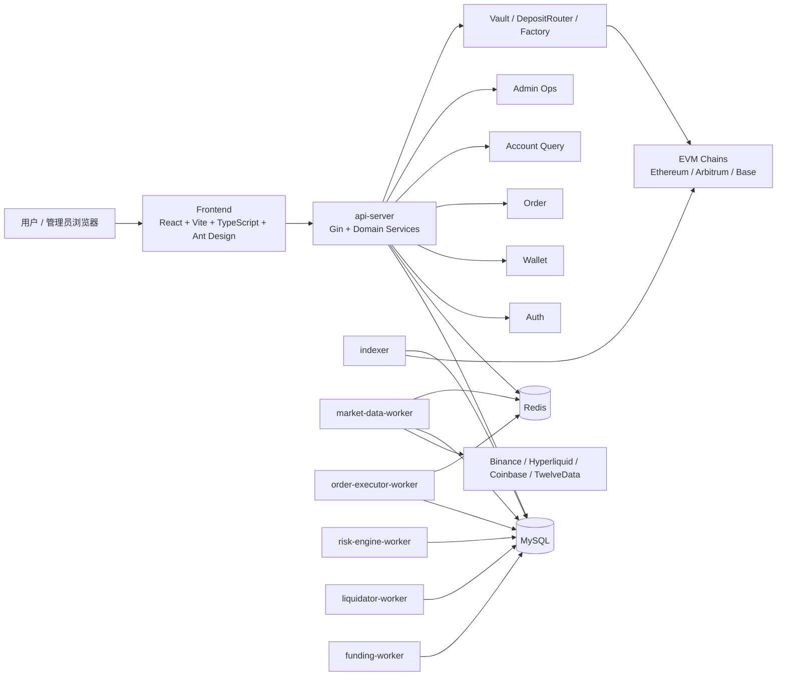
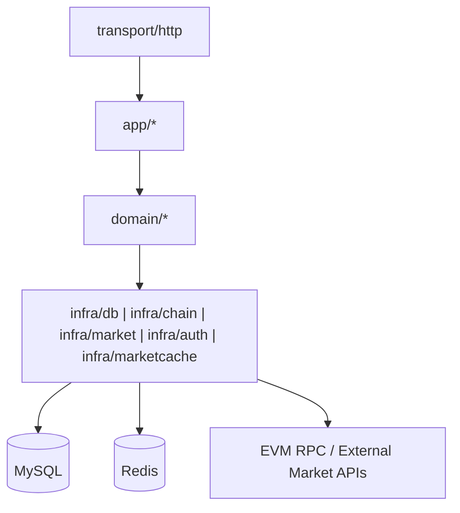
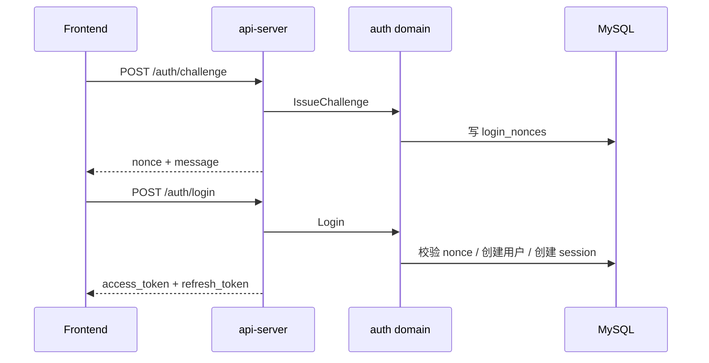
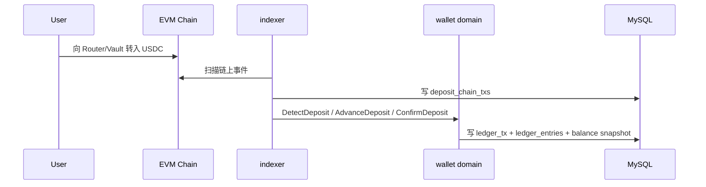
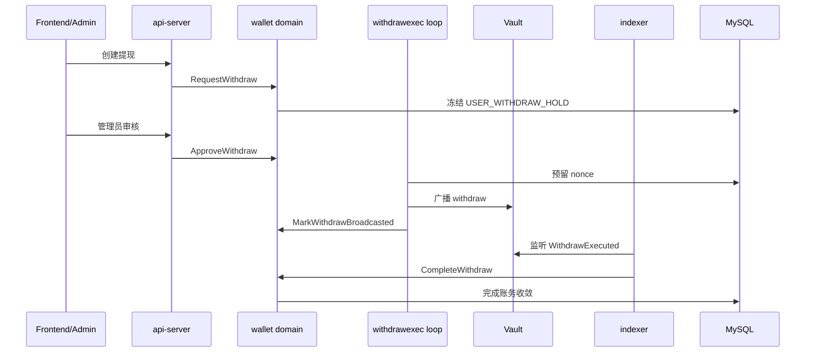
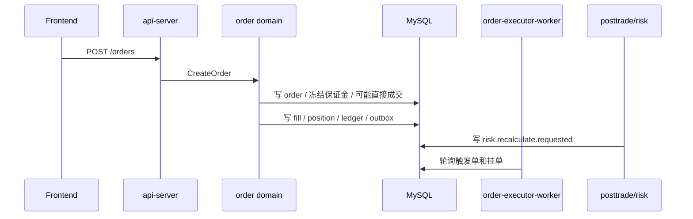
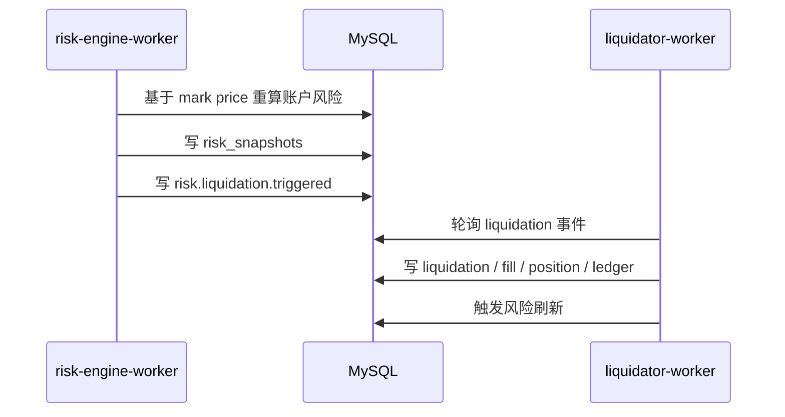
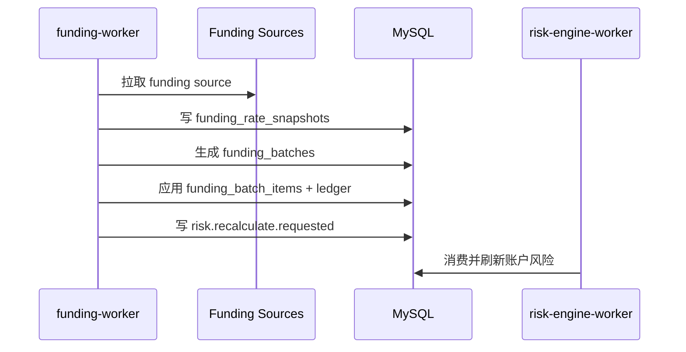

# 技术架构文档（基于当前实现）

## 1. 文档说明

本文档基于当前仓库中的实际实现编写，而不是目标态蓝图。

覆盖依据包括：

- `backend/cmd/*` 的实际运行进程；
- `backend/internal/domain/*` 的领域能力；
- `backend/internal/transport/http/*` 的真实 API；
- `backend/internal/infra/*` 的数据库、链上与市场数据适配器；
- `contracts/src/*` 的已实现合约；
- `frontend/src/pages/*` 的已落地页面。

因此，本文件优先回答三个问题：

1. 系统现在实际是如何运行的；
2. 核心模块如何协作并维护资金与交易正确性；
3. 哪些能力已经落地，哪些能力仍处于保留或半接入状态。

## 2. 当前实现快照

截至当前代码基线，系统已经实现并接通了以下主链路：

- EVM 地址 challenge/login 登录；
- 多链充值地址生成；
- Indexer 扫描 Vault/Router 相关链上事件并推进充值、提现链路；
- 用户充值入账、提现申请、审核、链上广播、完成、退款；
- 用户间内部转账；
- 行情采集与标记价快照；
- 永续订单创建、撤单、成交、仓位更新；
- 账户风险重算与强平触发；
- Liquidator 执行清算；
- Funding Worker 采集资金费率、生成批次、应用结算、支持反向冲正；
- Explorer 事件查询；
- Admin 运行时配置、风控重算、强平重试/关闭、保险基金补充、账本审计。

当前仍属于保留或未接入主运行时的能力：

- 独立 `hedger-worker` 未接入运行进程；
- `hedge` 领域与 `hedge_*` 表结构已存在，但尚未形成完整运行链路；
- `outbox-relay` 与 `notification-worker` 在 `cmd/README` 中保留，但当前代码未接入；
- RabbitMQ 配置仍保留在静态配置中，但当前关键异步路径主要通过数据库 `outbox_events` 轮询实现；
- WebSocket 网关未落地，前端以 HTTP 轮询和写后刷新为主。

## 3. 架构目标与当前取舍

系统当前仍遵循最初的核心架构思想，但实现上采取了更务实的交付路径：

- 托管与提现真相在链上；
- 账本、订单、仓位与风险真相在 MySQL；
- 异步编排优先通过数据库 outbox 和轮询 worker 完成；
- 运行时采用“模块化单体 + 多进程 worker”而不是微服务。

这一取舍的直接结果是：

- 财务主链路更容易保证事务一致性；
- 开发、联调、本地 review 和 docker compose 启动成本更低；
- 代价是系统当前更偏 DB-centric，真正的消息总线和独立对冲进程仍是后续演进方向。

## 4. 顶层架构

## 5. 当前运行拓扑

### 5.1 实际进程

| 进程 | 作用 | 当前状态 |
| --- | --- | --- |
| `api-server` | HTTP 入口、认证、账户、钱包、订单提交、管理接口 | 已接入 |
| `indexer` | 扫描链上事件，推进充值/提现状态 | 已接入 |
| `market-data-worker` | 抓取市场数据并写入行情快照与 Redis 热缓存 | 已接入 |
| `order-executor-worker` | 执行挂单/触发单，完成成交、仓位和账本更新 | 已接入 |
| `risk-engine-worker` | 风险重算，消费风险重算请求，产生强平触发 | 已接入 |
| `liquidator-worker` | 消费强平触发并执行清算 | 已接入 |
| `funding-worker` | 资金费率采集、批次生成、应用与回推风险重算 | 已接入 |
| `migrator` | 数据库迁移辅助进程 | 已接入 |
| `hedger-worker` | 对冲执行 | 保留，未接入 |
| `outbox-relay` | outbox 转发器 | 保留，未接入 |
| `notification-worker` | 通知异步消费 | 保留，未接入 |

### 5.2 运行时特点

- `api-server` 当前还内置了提现广播执行循环；
- 多个 worker 不通过 MQ 直接订阅消息，而是轮询数据库中的 `outbox_events`；
- 配置中心采用运行时快照 + 轮询刷新模式，多个进程每 2 秒刷新一次运行时配置；
- 市场数据热值进入 Redis，但 Redis 不承担任何财务真相角色。

## 6. 代码级模块分层

### 6.1 分层结构

### 6.2 各层职责

- `transport/http`
  负责 Gin handler、中间件、鉴权、HTTP DTO 和返回格式。
- `app`
  负责跨领域编排，当前主要包括 `adminops`、`posttrade`、`runtimeconfig`。
- `domain`
  承载核心业务规则，当前实际存在 `auth`、`wallet`、`ledger`、`order`、`risk`、`liquidation`、`funding`、`indexer`、`withdrawexec`、`market`、`hedge`。
- `infra`
  实现数据库仓储、链上适配器、市场数据客户端、JWT、Redis 缓存。

### 6.3 关键应用层组件

- `posttrade.Processor`
  在订单成交后发出 `risk.recalculate.requested` outbox 事件。
- `runtimeconfig.Service`
  维护动态运行时配置的查询与更新。
- `adminops.Service`
  承载保险基金补充、强平重试、强平关闭等管理动作。

## 7. 组件与职责边界

### 7.1 Frontend

当前前端页面已覆盖：

- `landing`
- `login`
- `trade`
- `portfolio`
- `wallet/deposit`
- `wallet/withdraw`
- `wallet/transfer`
- `history`
- `explorer`
- `admin`

当前前端特征：

- 以 HTTP 读写为主；
- 没有独立 WS 推送通道；
- 管理页已经接入运行时配置、账本审计、强平和提现运维接口；
- 用户视图已覆盖交易、资产、资金流水、Explorer 事件。

### 7.2 API Server

`api-server` 是当前系统的同步编排中心，真实暴露的 API 包括：

- `/api/v1/auth/*`
- `/api/v1/system/chains`
- `/api/v1/markets/*`
- `/api/v1/account/*`
- `/api/v1/wallet/*`
- `/api/v1/orders`、`/fills`、`/positions`
- `/api/v1/explorer/events`
- `/api/v1/admin/*`

它除了 HTTP 入口外，还承担：

- Bootstrap 系统账户和市场基础数据；
- 加载并轮询运行时配置；
- 在本地 review/dev 模式下启动链上提现执行循环；
- 组合多个 query repository，形成面向前端的读模型。

### 7.3 Auth

认证链路已完整实现：

- challenge/nonce 发放；
- EVM 签名验证；
- 用户自动创建；
- access/refresh token 签发；
- JWT 验证；
- 基于配置钱包地址的 admin 身份识别。

### 7.4 Wallet

钱包域当前是实现最完整的资金域之一，覆盖：

- 充值检测、推进、确认、重组回退；
- 充值地址生成；
- 提现申请、审核、退回复核、失败、广播、完成、退款；
- 用户内部转账；
- 本地 native faucet 支持；
- 提现风险评估器接入。

### 7.5 Indexer

Indexer 当前直接对 EVM RPC 轮询扫描，负责：

- 读取链上 `DepositForwarded`、`WithdrawExecuted` 等事件；
- 维护 `chain_cursors`；
- 多链确认数推进；
- 将链上事实写入 `deposit_chain_txs`；
- 通过调用 wallet domain 完成充值确认和提现完成回补；
- 对未知或异常链上情况发出 `wallet.indexer.anomaly` outbox 事件。

### 7.6 Market Data

市场数据 worker 当前使用以下源：

- Binance；
- Hyperliquid；
- Coinbase；
- TwelveData（可选）。

它负责：

- 拉取 ticker/quote 元数据；
- 聚合指数价和标记价；
- 写入 `market_price_snapshots`、`mark_price_snapshots`；
- 刷新 Redis 最新行情缓存；
- 为交易、风险、资金费率提供统一价格输入。

### 7.7 Order / Execution

订单域当前已支持：

- `MARKET`
- `LIMIT`
- `STOP_MARKET`
- `TAKE_PROFIT_MARKET`

同时支持：

- `OPEN` / `REDUCE` / `CLOSE`
- `CROSS` / `ISOLATED`
- `LONG` / `SHORT`
- 挂单轮询执行；
- 触发单轮询执行；
- 成交后账本与仓位原子更新；
- 撤单。

### 7.8 Risk

风险域当前已落地：

- 账户级风险快照；
- 权益、可用余额、维持保证金、风险率计算；
- 风险等级 `SAFE / NO_NEW_RISK / LIQUIDATING`；
- 标记价驱动的轮询重算；
- 成交/资金费率驱动的风险重算请求消费；
- 强平触发写入 outbox。

对冲相关现状：

- `risk` 域已能计算 `hedge intent` 并写入 `hedge.requested` 事件；
- 但当前运行时没有对应该事件的执行进程，因此对冲链路未闭环。

### 7.9 Liquidation

强平域当前由独立 worker 驱动，具备：

- 消费 `risk.liquidation.triggered`；
- 执行清算；
- 写入 `liquidations` 与 `liquidation_items`；
- 生成强平成交、仓位变化和账本变更；
- 在清算结束后再次触发风险刷新；
- 支持 admin 侧重试和手工关闭。

### 7.10 Funding

Funding 当前已经是完整运行链路：

- 多源资金费率采集；
- 资金费率归一化与聚合；
- 生成 `funding_batches`；
- 应用 `funding_batch_items`；
- 对受影响用户发出 `risk.recalculate.requested`；
- 支持 admin 逆向冲正 funding batch。

### 7.11 Explorer 与 Admin

Explorer 当前并没有单独的事件投影进程，而是直接查询：

- `outbox_events`
- `ledger_tx`
- `orders`
- `fills`
- `positions`
- `deposit_chain_txs`
- `withdraw_requests`

Admin 当前已经落地的运维能力包括：

- 提现审核、退回复核、退款；
- 风险监控面板；
- 账户风险重算；
- 强平重试与关闭；
- 资金费率批次查看与反转；
- 运行时配置查看与更新；
- 账本概览、一键审计、审计导出；
- 保险基金补充。

## 8. 数据拥有权与真相源

### 8.1 真相源划分

| 数据类别 | 当前真相源 | 说明 |
| --- | --- | --- |
| 托管资产与提现执行 | EVM 链事件与 Vault 状态 | 最终以链上为准 |
| 用户资金变化 | `ledger_tx` + `ledger_entries` | 账本是资金真相 |
| 余额读优化 | `account_balance_snapshots` | 可重建，不是独立真相 |
| 订单 | `orders` | 订单生命周期真相 |
| 成交 | `fills` | 成交真相 |
| 仓位 | `positions` | 用户持仓真相 |
| 风险快照 | `risk_snapshots` | 风控执行结果快照 |
| 资金费率批次 | `funding_batches` / `funding_batch_items` | 批处理真相 |
| 链上索引游标 | `chain_cursors` | 多链扫描恢复点 |
| 异步事件 | `outbox_events` | 当前异步编排中枢 |
| 消费幂等 | `message_consumptions` | worker 去重记录 |

### 8.2 当前实现中的关键原则

- 所有资金类变化必须经账本落地；
- 余额快照只是读优化；
- 业务成功不得早于账本提交；
- worker 的异步处理必须显式幂等；
- Redis 不保存不可恢复的财务事实。

## 9. 实际异步模型

当前实现最重要的一个架构事实是：

系统虽然保留了 RabbitMQ 配置和目标态设计，但当前异步执行主要不是依赖 MQ，而是依赖数据库 outbox + 轮询 worker。

### 9.1 当前异步链路模式

1. 业务事务在 MySQL 中提交源表与 `outbox_events`。
2. 后台 worker 周期性轮询特定 `event_type`。
3. worker 通过 `message_consumptions` 做消费去重。
4. 成功后保留消费记录，失败则删除消费记录并等待下次重试。

### 9.2 当前使用该模型的链路

- post-trade -> `risk.recalculate.requested`
- risk -> `risk.liquidation.triggered`
- funding -> `risk.recalculate.requested`
- indexer / wallet / liquidation / funding 各类审计与 Explorer 事件

### 9.3 当前异步模型的特点

优点：

- 无需独立消息基础设施即可完成关键编排；
- 与财务事务天然同库，易于审计和排错；
- 非常适合当前单库多进程架构。

代价：

- 异步延迟由轮询周期决定；
- DB 压力高于真正的消息队列；
- 需要严格控制 outbox 清理与幂等逻辑。

## 10. 核心数据流

### 10.1 登录链路

### 10.2 充值链路

### 10.3 提现链路

### 10.4 订单与成交链路

### 10.5 风险与清算链路

### 10.6 资金费率链路

## 11. 状态机

### 11.1 充值

`DETECTED -> CONFIRMING -> CREDIT_READY -> CREDITED -> SWEPT`

异常分支：

- `DETECTED -> REORG_REVERSED`
- `ANY -> FAILED`

### 11.2 提现

`REQUESTED -> HOLD -> RISK_REVIEW -> APPROVED -> SIGNING -> BROADCASTED -> CONFIRMING -> COMPLETED`

异常分支：

- `HOLD -> CANCELED`
- `RISK_REVIEW -> REJECTED`
- `BROADCASTED/CONFIRMING -> FAILED -> REFUNDED`

当前实现中特别重要的一点：

- `SIGNING` 表示 nonce 已经预留，发送结果若不确定，不能退回 `APPROVED` 重分配 nonce。

### 11.3 订单

当前实现中的主状态：

- `TRIGGER_WAIT`
- `RESTING`
- `FILLED`
- `CANCELED`
- `REJECTED`

### 11.4 仓位

当前实现中的主状态：

- `OPEN`
- `CLOSED`
- `LIQUIDATING`

### 11.5 风险等级

- `SAFE`
- `NO_NEW_RISK`
- `LIQUIDATING`

### 11.6 Funding Batch

Funding 批次当前已经覆盖：

- 创建；
- 应用；
- 反转。

## 12. 关键设计权衡

### 12.1 模块化单体 + 多进程，而不是微服务

当前选择：

- 单一 Go 代码库；
- 共享领域包；
- 单一 MySQL schema；
- 多 worker 按负载拆开。

收益：

- 资金与交易主链路更容易做强一致事务；
- 本地和 review 环境更容易启动；
- 代码边界清晰，但不必承受微服务治理成本。

代价：

- 同库耦合较强；
- 异步链路更多依赖轮询而不是事件总线；
- 后续拆分服务时需要重新梳理跨边界契约。

### 12.2 MySQL outbox 轮询，而不是先上 RabbitMQ

当前选择：

- 关键异步路径直接基于 `outbox_events`；
- worker 轮询特定事件类型并消费。

收益：

- 事务内写出更简单；
- 排错时可以直接从数据库回溯；
- 对当前阶段更稳妥。

代价：

- 吞吐和时延上不如真正消息队列；
- outbox 表会成为核心热点之一；
- 需要额外关注轮询频率、归档和清理。

### 12.3 API 内置提现执行循环，而不是独立广播服务

当前选择：

- `api-server` 在存在本地 minter 私钥时，直接启动提现执行循环。

收益：

- 开发和 review 环境路径更短；
- 少一个独立部署进程。

代价：

- API 进程承担了部分后台任务职责；
- 未来生产化时更适合独立成 `withdraw-executor-worker`。

### 12.4 对冲逻辑先建模，再延后接线

当前选择：

- `risk` 与 `hedge` 领域、数据库表和事件已建好；
- 但真正的 hedger runtime 尚未接通。

收益：

- 风险模型与后续对冲接口已预留；
- 不阻塞当前交易、风控、清算主链路上线。

代价：

- 当前系统没有完成外部敞口自动收敛闭环；
- 文档和实现必须清楚区分“已实现”和“预留”。

## 13. 非功能架构

### 13.1 一致性

- 账本、余额快照、订单、成交、仓位等关键变化在数据库事务内提交；
- 修正通过反向分录和补充分录完成；
- 资金主链路不依赖缓存。

### 13.2 幂等与恢复

- 钱包、订单、资金费率、强平链路均显式使用幂等键；
- worker 消费使用 `message_consumptions` 去重；
- Indexer 通过 `chain_cursors` 支持恢复；
- 提现通过预留 nonce + 回补机制降低 orphan broadcast 风险。

### 13.3 安全

- EVM challenge/login 使用 nonce、链 ID、过期时间；
- JWT 作为访问凭证；
- Admin 身份由配置白名单地址识别；
- 链上提现执行与链下审批分离；
- 异常链上事件不会直接进入余额。

### 13.4 可观测性

当前主要依赖：

- 结构化日志；
- 数据库中可审计记录；
- Admin 查询和导出接口；
- Explorer 对 outbox 事件和业务对象的聚合视图。

### 13.5 运维可调性

运行时配置当前支持动态更新：

- 全局 trace 要求；
- 市场参数；
- 风险参数；
- funding 参数；
- hedge 开关和阈值；
- pair 级配置。

多个进程会持续拉取最新运行时配置快照并生效。

## 14. 当前实现亮点

- 资金主链路已经是生产思路，而不是 Demo 级别的余额字段加减。
- 多链充值/提现、确认数、重组、提现 nonce 预留和回补都已经进入真实实现。
- 交易、风控、强平、资金费率已经形成闭环，不依赖手工脚本串联。
- Admin 运维面已经不是只读，已经具备强平、funding reversal、保险基金补充、账本审计等生产操作入口。
- 动态运行时配置已经真正接入多个进程，而不是静态配置文件重启生效。
- 当前架构虽然偏单体，但领域边界清晰，后续拆分 worker 或服务有基础。

## 15. 当前实现边界与后续演进方向

当前实现仍应被视为“高完成度核心交易系统”，而不是最终完全形态。主要演进方向包括：

- 将 hedger runtime 接通，完成 `hedge.requested -> hedge.updated` 闭环；
- 将 outbox 轮询逐步升级为真正的消息总线；
- 将提现执行从 `api-server` 中剥离成独立 worker；
- 为 Explorer 引入更明确的投影层；
- 视交易实时性要求补充 WebSocket/SSE 推送；
- 继续从 DB-centric 架构演进到更清晰的异步边界。

## 16. 总结

基于当前代码实现，本系统的真实架构可以概括为：

- 链上托管；
- 链下账本、交易、风险和清算；
- MySQL 作为交易与资金真相中心；
- Redis 作为行情热缓存；
- 多个后台 worker 基于数据库 outbox 轮询协作；
- 前端和管理后台通过统一 HTTP API 访问系统。

它不是一个“目标态 PPT 架构”，而是已经能跑通登录、充值提现、交易、风控、强平、资金费率、管理审计等主链路的模块化单体交易系统。
