# RGPerp 演示文档

本文档按核心链路展开演示步骤，每步预留截图位置，便于配合操作截图形成完整演示材料。

---

## 一、演示概述

RGPerp 采用**链上托管 + 链下 CFD 交易 + 统一账本 + 异步 Worker** 的架构：

- **链上**：Vault / 充值路由等合约；充值、提现以链上事件为结算依据，经 **indexer** 入账
- **链下**：**api-server** 提供 REST API；市价/可立即成交路径在**单事务**内完成订单、成交、仓位、账本与 **Outbox**
- **异步**：**market-data**（行情）、**order-executor-worker**（挂单/触发单）、**risk-engine-worker**、**liquidator-worker**、**funding-worker**、**hedger-worker** 等独立进程协同
- **数据**：MySQL 为权威存储；Redis 承载行情热点读取加速

**核心演示链路**：钱包登录 → 链上充值 → 开仓 → 持仓与风控 → 平仓 → 提现（可选：清算、限价/触发单、管理端、资金费）

---

## 二、步骤一：登录首页

### 操作

1. 浏览器访问 `http://127.0.0.1:5173`
2. 查看 **Landing** 落地页
3. 进入 **登录**（`/login`）或直接进入交易壳（登录后常用 `/trade`）

### 预期

- 落地页展示品牌与入口
- 可导航至登录或交易相关路由

<!-- 图1：Landing 首页 -->
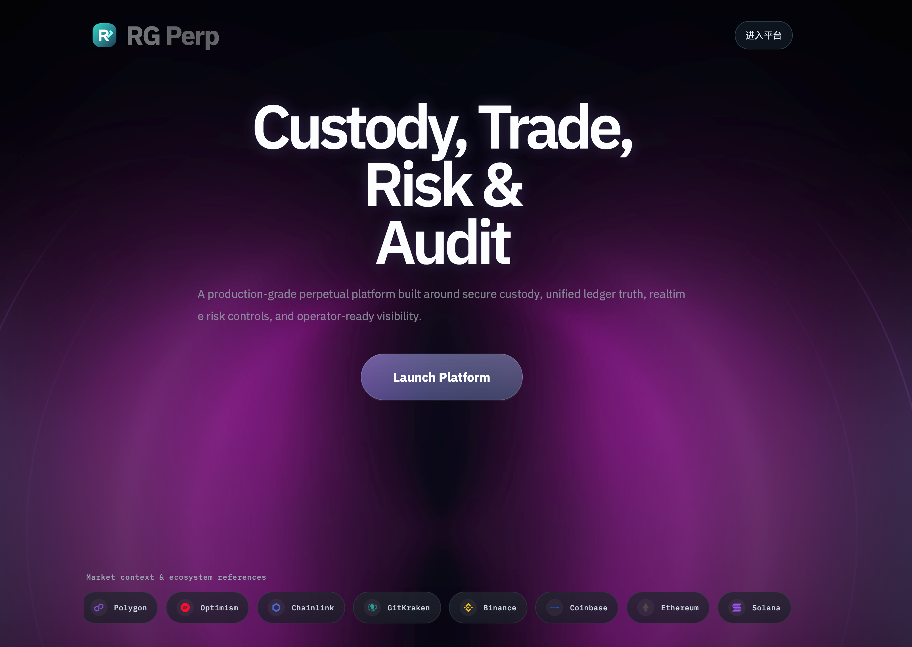

<!-- 图2：进入登录或应用 -->
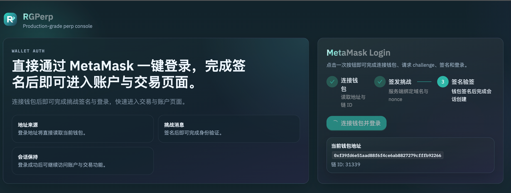

---

## 三、步骤二：钱包连接与登录

### 操作

1. 在登录页连接 MetaMask（或兼容钱包）
2. 选择本地链（如 **Chain ID 31337**，RPC `http://127.0.0.1:8545`，以本地环境为准）
3. 获取签名挑战并在钱包中签名
4. 登录成功后进入应用壳，可访问 `/trade`、`/portfolio` 等

### 技术说明

- 后端 **`/api/v1/auth/challenge`** 返回 `nonce` 与待签名 `message`
- 用户对 `message` 签名后调用 **`/api/v1/auth/login`**
- 后端校验签名，返回 **JWT**，后续请求携带 `Authorization: Bearer <token>`

### 预期

- 钱包连接成功
- 完成签名后进入已登录状态，顶部或账户区展示地址

<!-- 图4：签名挑战与确认 -->
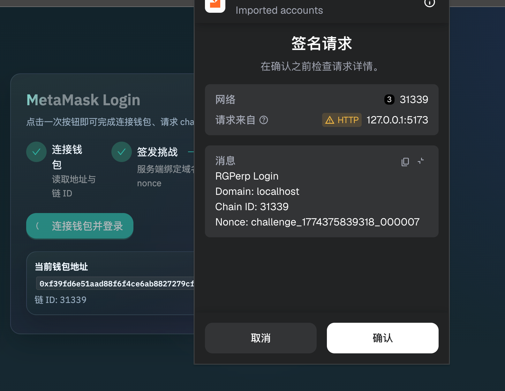

---

## 四、步骤三：链上充值

### 操作

1. 进入 **`/wallet/deposit`**（或资产/钱包入口中的充值）
2. 按页面指引完成 **USDC 授权**（若需要）
3. 调用 Vault / 路由合约完成 **deposit**
4. 等待链上确认；**indexer** 消费事件后，链下 **`available_balance`** 等读模型更新

### 技术说明

- 链上 `Deposit` 等事件经 **indexer** 幂等处理，与 **账本** 协同入账（具体账户科目以 `domain/ledger` 与 DDL 为准）
- 可在 **`/explorer`** 检索与充值相关的链上/链下事件

### 预期

- 链上交易成功
- 短时间内账户可用余额增加

<!-- 图6：充值入口与金额 -->
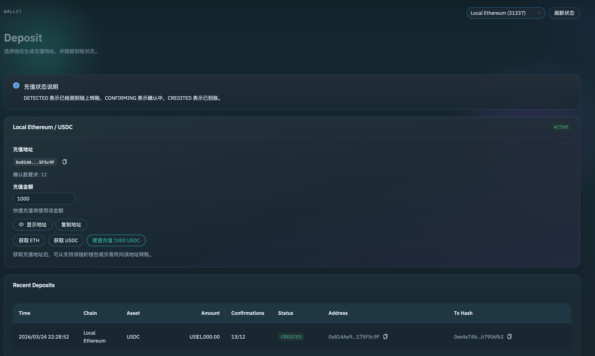

<!-- 图7：钱包确认充值交易 -->
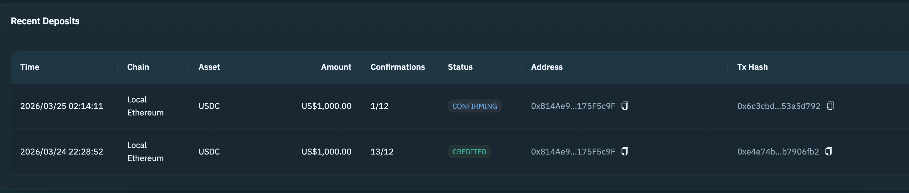

<!-- 图8：充值后余额更新 -->
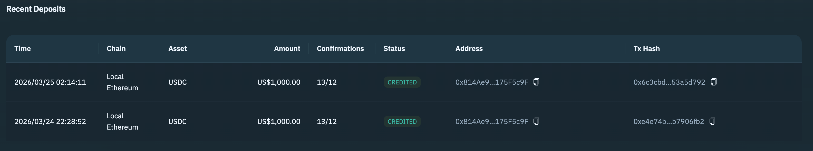

---

## 五、步骤四：开仓

### 操作

1. 进入 **`/trade`**
2. 选择交易对（如 **BTC-USDC**、**ETH-USDC**，以运行时配置为准）
3. 选择方向 **Long / Short**、杠杆、**全仓 / 逐仓**
4. 选择订单类型：**市价 MARKET** 或 **限价 LIMIT** 等
5. 输入数量（与精度、最小名义价值等约束以 API 校验为准）
6. 提交订单；建议对写操作携带 **`Idempotency-Key`**（与 OpenAPI 一致）

### 技术说明

- **CFD 参考价模式**：用户与平台在标记价/执行价规则下成交，非订单簿撮合
- 市价等可立即成交路径：**api-server** 内在**同一数据库事务**内更新订单、成交、仓位、**账本**与 **Outbox**
- **挂单 / 触发单**：由 **market-data** 与 **order-executor-worker** 等异步推进
- 风控：余额、杠杆、符号状态（交易/只减仓等）、价格新鲜度等

### 预期

- 订单返回成功，成交与仓位可见
- 可用余额与冻结保证金符合预期
- 若启用对冲，**hedger-worker** 侧可观察到净敞口相关处理（依配置而定）

<!-- 图9：下单面板 -->
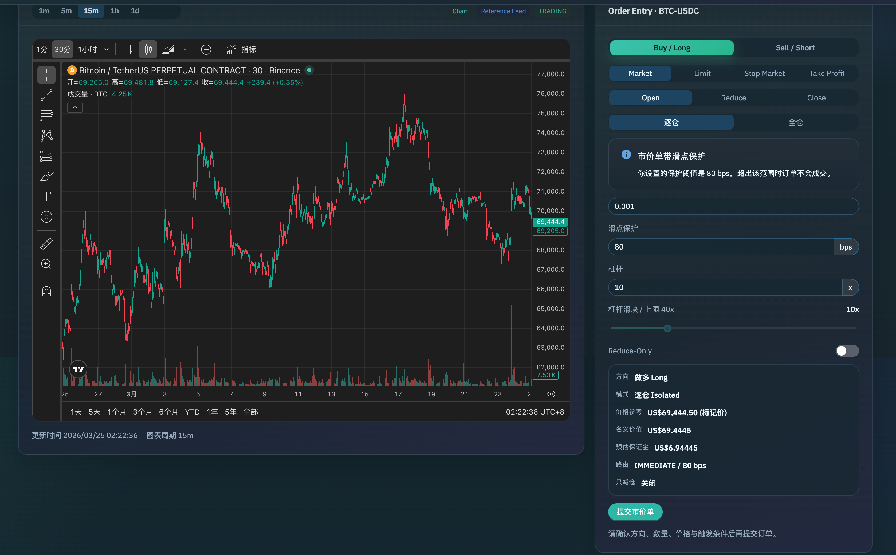

<!-- 图10：仓位创建 -->
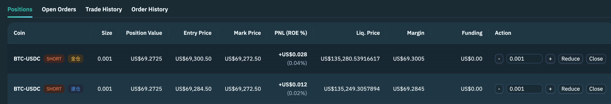

<!-- 图12：对冲任务或管理端（可选） -->
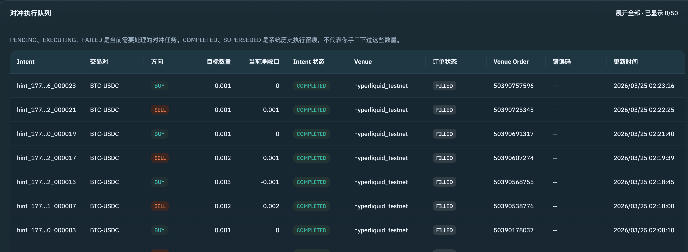

---

## 六、步骤五：持仓与风控

### 操作

1. 在 **`/trade`** 或仓位区域查看当前持仓
2. 查看未实现盈亏、标记价相关展示
3. 查看风险摘要 / 风险率 / 等级（以页面与 **`risk_snapshots`** 读模型为准）

### 技术说明

- 权益、维持保证金、风险率等计算见 **`domain/risk`** 与运行时配置（杠杆梯度、费率等）
- **risk-engine-worker** 周期性或事件驱动重算风险快照，必要时写入清算类 **Outbox** 事件

### 预期

- 仓位字段（开仓价、标记价、数量、杠杆、PnL）合理更新
- 风险指标随行情变化刷新

---

## 七、步骤六：平仓

### 操作

1. 在持仓上选择 **平仓 / 减仓** 或通过订单面板提交 **CLOSE / REDUCE** 类订单
2. 确认数量与类型（市价/限价/触发等，以产品支持为准）
3. 观察成交、仓位减少或清空

### 技术说明

- 平仓路径同样走订单与账本事务；净敞口变化可能触发 **hedge** 相关异步逻辑

### 预期

- 平仓成功，已实现盈亏反映到账户读模型
- 全平后仓位从当前列表消失或数量为 0

---

## 八、步骤七：提现

### 操作

1. 进入 **`/wallet/withdraw`**
2. 输入提现金额，提交申请
3. 按本地/环境配置完成 **审核、签名、链上 withdraw** 等步骤（以实际页面与后台流程为准）
4. **indexer** 确认链上事实后，链下余额扣减

### 技术说明

- 提现涉及风控、冻结与链上授权等多环节，具体以 **`domain/wallet`** 与合约接口为准

### 预期

- 提现链路完成后，链下可用余额减少，钱包代币余额增加（在成功链上转账前提下）

<!-- 图17：提现授权或审核（视环境） -->
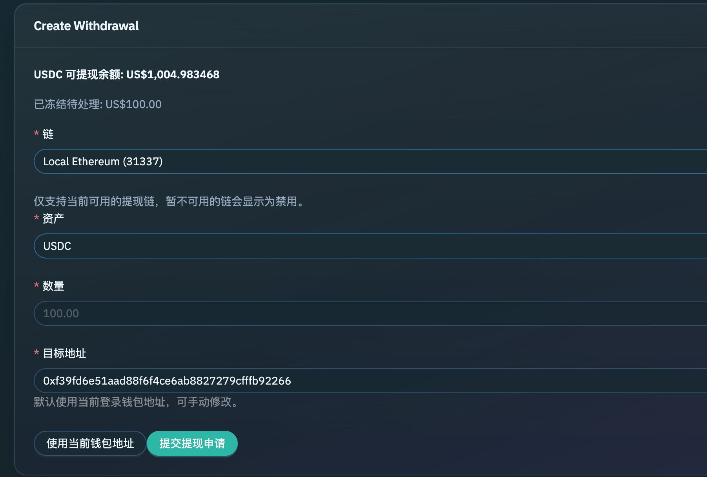

<!-- 图19：提现成功后余额 -->
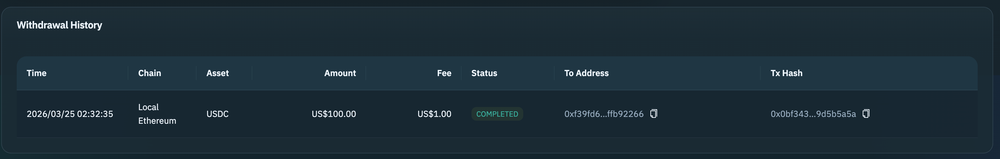

---

## 九、清算流程演示

当风险指标满足清算条件时，**liquidator-worker** 消费 **Outbox** 中的清算触发事件并执行清算领域逻辑。

### 前置条件

- 用户已开仓且具备足够名义价值
- 通过**行情/标记价**变化或测试手段使账户进入可清算状态（演示环境请遵循团队 runbook）

### 操作概要

1. 持有仓位（如 **BTC-USDC** 多仓）
2. 制造对持仓不利的价格条件（管理端改参数、测试数据或受控 mock，**勿在生产操作**）
3. **risk-engine-worker** 写入风险与清算相关 Outbox；**liquidator-worker** 执行强平
4. 在 **`/admin/liquidations`** 或 Explorer 中核对清算记录

### 预期

- 仓位被强制了结或按设计进入清算工单流
- 清算记录、成交与账本侧影响可追踪

<!-- 图21：清算记录 -->
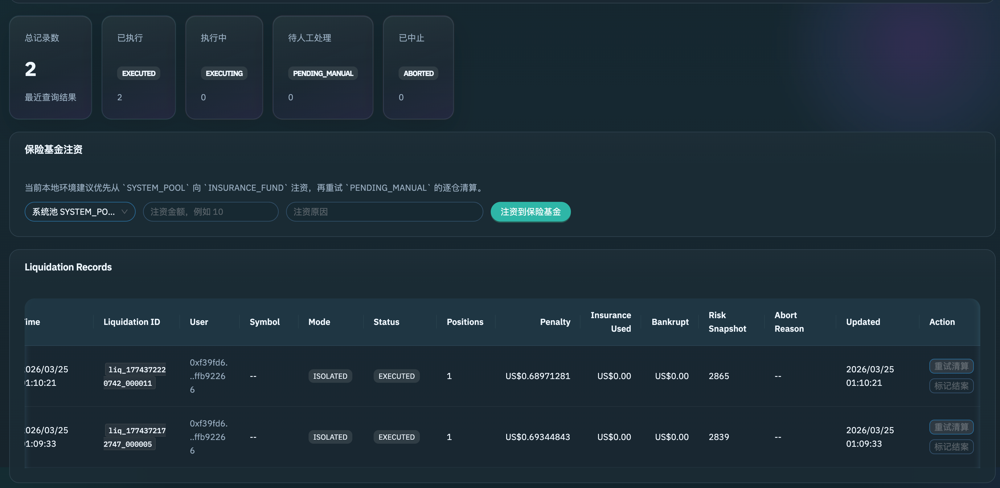

---

## 十、限价单与触发单流程演示

### 操作

1. 在 **`/trade`** 将订单类型切换为 **LIMIT** 或触发类（**STOP_MARKET** / **TAKE_PROFIT_MARKET** 等，以 UI 为准）
2. 选择交易对、方向、杠杆与保证金模式
3. 输入价格、数量并提交
4. 观察 **挂单** 进入 resting 状态，或由 **order-executor-worker** 在行情满足条件时触发成交
5. 在 **订单列表 / 历史** 中核对状态迁移；撤单验证冻结释放

### 技术说明

- 非订单簿撮合：**order-executor-worker** 与 **market-data** 协同，按标记价/指数价与规则判断成交与触发
- 幂等与重复提交：配合 **`Idempotency-Key`**；回归可参考 `deploy/scripts/trading-regression-local.sh`

### 预期

- 限价挂单可见，撤单成功则状态为 **CANCELED**
- 触发单在条件满足后成交，仓位与余额随之变化

<!-- 图24：限价/触发单创建 -->
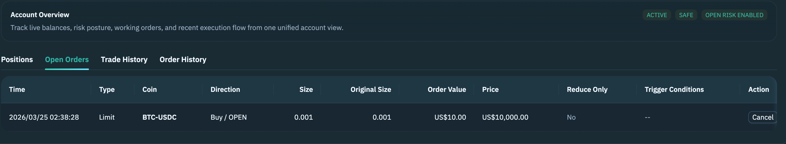

<!-- 图26：触发或成交结果 -->
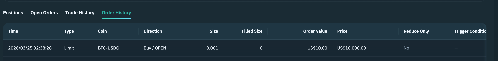

---

## 十一、Admin 管理页演示

### 操作

1. 使用**管理员白名单地址**对应的钱包登录
2. 打开 **`/admin/dashboard`** 及各子页：`/admin/withdrawals`、`/admin/liquidations`、`/admin/configs` 等
3. 查看提现审核、清算列表、运行时配置、保险基金等运营能力（以当前实现为准）

### 技术说明

- 管理接口位于 **`/api/v1/admin/*`**，与前端 **AdminOutlet** 权限配合
- 运行时参数（杠杆、手续费、符号状态等）由**运行时配置**服务治理

### 预期

- 非管理员无法访问管理路由
- 管理员可查看并操作受权功能

<!-- 图27：Admin 总览 -->
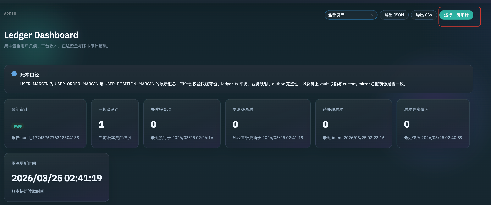

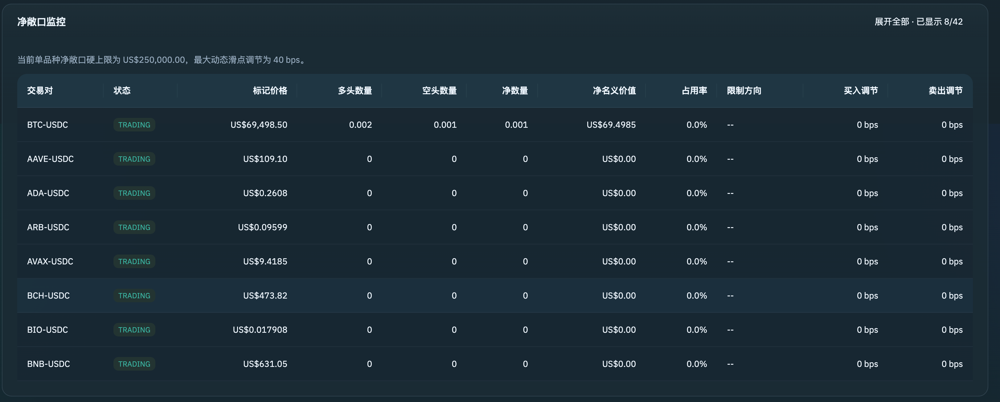

<!-- 图28：对冲或任务列表（若启用） -->
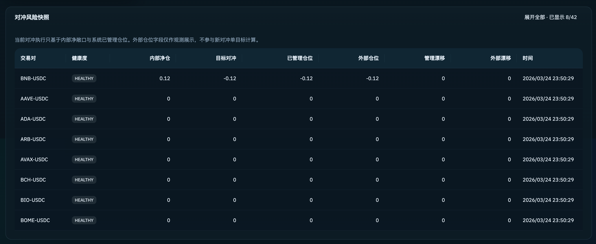

<!-- 图29：风险与清算 -->

---

## 十二、看板演示

### 操作

1. 在交易页关注 **资金费** 相关展示或倒计时
2. 持仓跨越 **funding** 结算点后，在 **`/history/funding`** 查看记录
3. 在 **`/portfolio`** 查看资产摘要

### 技术说明

- **funding-worker** 按配置周期结算，结果进入账本与历史查询接口

### 亮点总结（与对外架构一致）

- **链上托管 + 链下 CFD 执行 + 统一账本**
- **事务性 Outbox** 编排异步风控、清算、资金费、对冲等
- **多进程 Worker**：行情、执行、风险、清算、资金费、索引、对冲
- **Docker Compose** 一键拉起 API 与 Worker（见 `docker-compose.yml`）
- **OpenAPI / DDL / 事件 Schema** 契约化交付（`spec/`）

<!-- 图30：资金费倒计时或提示 -->
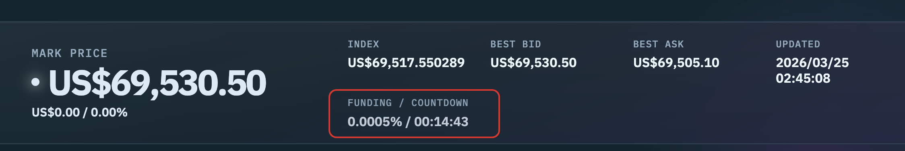

<!-- 图31：资金费历史 -->
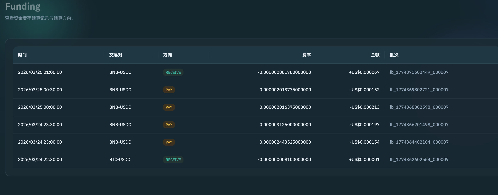

<!-- 图32：提现审核 -->
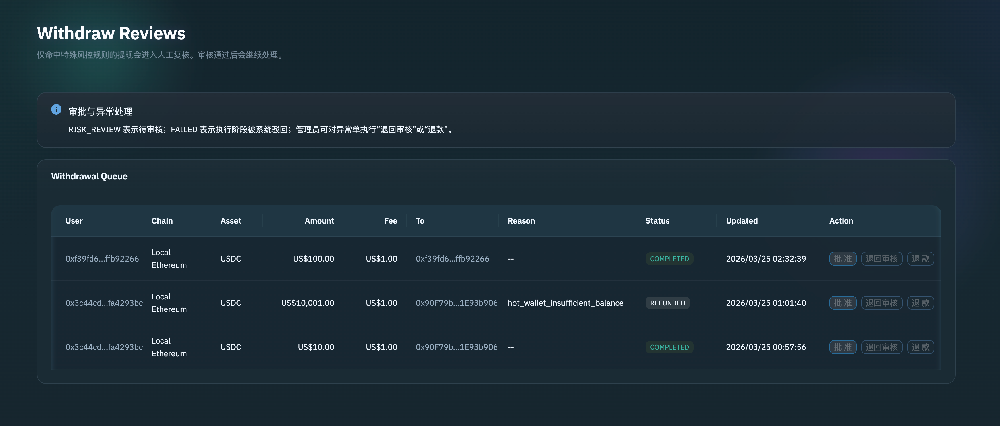

<!-- 图33：配置动态调整 -->
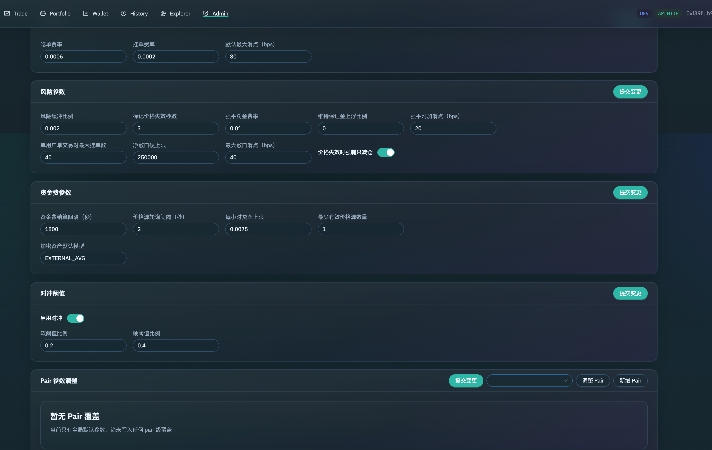

---

## 十三、附录：演示账户与脚本

本地演示私钥与地址常以 **Anvil 默认账户** 或团队约定为准。自动化回归示例见：

- `deploy/scripts/trading-regression-local.sh`（内含 `ADMIN_PRIVATE_KEY` / `USER_PRIVATE_KEY` 等环境变量示例）

| 角色 | 说明 |
|------|------|
| 管理员 | 使用配置中的 **Admin 白名单地址** 登录管理端 |
| 普通用户 | 使用 Anvil 另一默认账户或脚本中的 **USER** 对应地址演示交易 |

合约与环境变量以 **`deploy/env/local-chains.env`**（或由 bootstrap 生成路径）及 `frontend/.env.local` 为准。

---
