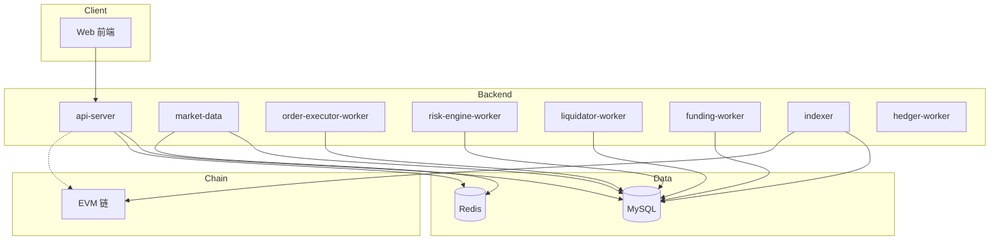

# RGPerp 项目模块功能说明

本文档说明各模块职责与协作关系，结构与配图方式对齐仓库内 `Architecture` / `TECH_ARCHITECTURE` 类文档习惯：示意图以 Mermaid 或静态图补充，截图置于 `docs/demo_images/`。

---

## 一、系统概述

RGPerp 采用**链上托管 + 链下交易与账本 + 异步 Worker** 的架构：

- **链上**：Vault / DepositRouter 等合约与链上事件
- **链下**：`api-server` 提供 HTTP API；订单、账本、风控、清算等在应用与领域层完成
- **异步**：行情聚合、挂单/触发单执行、风险重算、清算、资金费、索引、对冲等独立进程消费 DB/Outbox
- **数据**：MySQL 为主存，Redis 承载行情热点缓存等；RabbitMQ 按环境接入

---

## 二、顶层架构



<!-- 图1：系统上下文 / 部署拓扑 -->


<!-- 图2：模块依赖（可选，与 Mermaid 等价） -->


---

## 三、后端进程（`backend/cmd`）

| 进程 | 主要职责 |
|------|----------|
| **api-server** | HTTP：认证、账户/钱包、行情查询、下单撤单、Explorer、管理端、运行时配置等 |
| **market-data** | 多源行情、聚合、写库/Redis；驱动挂单执行等 |
| **order-executor-worker** | 挂单与触发单等与行情相关的执行 |
| **risk-engine-worker** | 风险重算、风险快照、清算触发类 Outbox |
| **liquidator-worker** | 消费清算触发，执行清算领域流程 |
| **funding-worker** | 资金费批次与落账 |
| **indexer** | 链上充值/提现等事件索引与入账协同 |
| **hedger-worker** | 净敞口与对冲（按配置） |
| **migrator** | 数据库迁移 |
| **api-stress** | API 压测工具（非线上常驻） |

<!-- 图3：后端进程列表（如 docker compose ps） -->


---

## 四、领域与分层（`backend/internal`）

| 领域模块 | 包路径 | 功能摘要 |
|----------|--------|----------|
| 认证与会话 | `domain/auth` | Nonce、签名登录、JWT、会话 |
| 账本 | `domain/ledger` | 分录、事务、余额快照、幂等 |
| 钱包 | `domain/wallet` | 充值、提现、转账、地址分配 |
| 行情 | `domain/market` | 多源聚合、健康度 |
| 订单 | `domain/order` | 下单、撤单、市价/限价/触发、仓位与账本协同 |
| 风险 | `domain/risk` | 风险快照、强平触发、Outbox |
| 清算 | `domain/liquidation` | 清算执行与落账 |
| 资金费 | `domain/funding` | 资金费结算 |
| 对冲 | `domain/hedge` | 对冲意图与状态 |
| 读模型 | `domain/readmodel` | API DTO |
| 应用编排 | `app/*` | 运行时配置、管理操作、post-trade 风险投递等 |
| 持久化 | `infra/db` | GORM、事务 |
| 行情缓存 | `infra/marketcache` | Redis |
| 链 | `infra/chain` | RPC、签名、提现执行等 |
| HTTP | `transport/http` | Gin 路由与 Handler |

<!-- 图4：IDE 目录树 domain / infra -->


---

## 五、前端模块（路由见 `frontend/src/app/router.tsx`）

| 路径 | 功能 |
|------|------|
| `/` | 落地页 |
| `/login` | 钱包签名登录 |
| `/trade` | 交易：行情、下单、订单/成交/仓位、风险摘要 |
| `/portfolio` | 资产概览 |
| `/wallet/deposit` | 充值 |
| `/wallet/transfer` | 站内转账 |
| `/wallet/withdraw` | 提现 |
| `/history/orders` | 订单历史 |
| `/history/fills` | 成交历史 |
| `/history/positions` | 仓位历史 |
| `/history/funding` | 资金费历史 |
| `/history/transfers` | 转账历史 |
| `/explorer` | 事件检索 |
| `/admin/dashboard` | 运营仪表盘 |
| `/admin/withdrawals` | 提现审核 |
| `/admin/liquidations` | 清算记录 |
| `/admin/configs` | 运行时配置 |

<!-- 图5：交易页 -->


<!-- 图6：钱包 / 充值 -->


<!-- 图7：管理后台 -->


---

## 六、关键链路

### 6.1 下单

前端 → `api-server` → 订单领域（事务内校验、冻结/成交、订单与成交、仓位、账本、Outbox）→ `risk-engine-worker` 异步重算；挂单/触发单由 `market-data` / `order-executor-worker` 推进。

<!-- 图8：下单链路（Network / 追踪） -->


### 6.2 充值入账

链上事件 → `indexer` → 确认与账本入账 → 前端展示。

<!-- 图9：充值与 Explorer -->


### 6.3 风控与清算

`risk-engine-worker` 重算并写 Outbox → `liquidator-worker` 执行清算领域；与后台人工流配合。

<!-- 图10：清算记录 -->


### 6.4 资金费

`funding-worker` 周期结算 → 账本与用户历史查询。

<!-- 图11：资金费历史 -->


---

## 七、合约与部署

| 模块 | 路径 |
|------|------|
| 合约 | `contracts/` |
| 部署脚本与镜像 | `deploy/` |
| 本地编排 | `docker-compose.yml` |

<!-- 图12：Compose / 端口 -->


---

## 八、规范与任务

| 路径 | 用途 |
|------|------|
| `spec/` | OpenAPI、DDL、事件 Schema、`TASKS.md` |
| `docs/` | 架构、风控、账本、订单执行等 |
| `requirements/` | 需求与技术设计总述 |

<!-- 图13：文档与规范入口 -->


---

## 九、附录：`docs/demo_images` 文件清单

```text
docs/demo_images/
  mod-01-architecture.png
  mod-02-dependencies.png
  mod-03-processes.png
  mod-04-packages.png
  mod-05-trade.png
  mod-06-wallet.png
  mod-07-admin.png
  mod-08-order-flow.png
  mod-09-deposit.png
  mod-10-liquidation.png
  mod-11-funding.png
  mod-12-deploy.png
  mod-13-docs.png
```

---

*对照说明：配图与章节组织参考 `~/perpexchange/DEMO.md`、`Architecture.md`、`spec/TECH_ARCHITECTURE.md`。*
